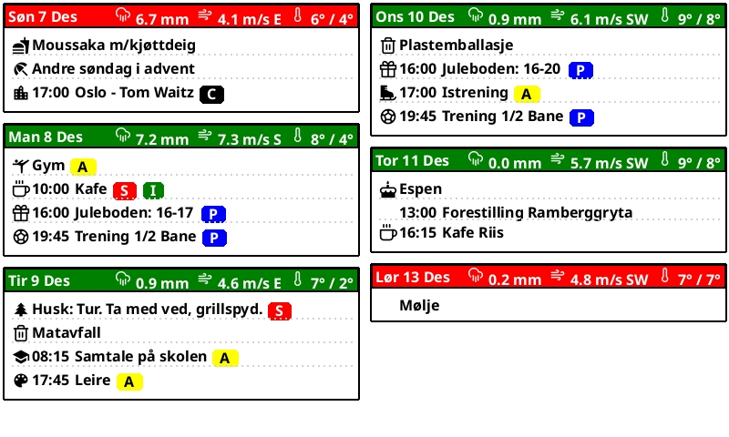
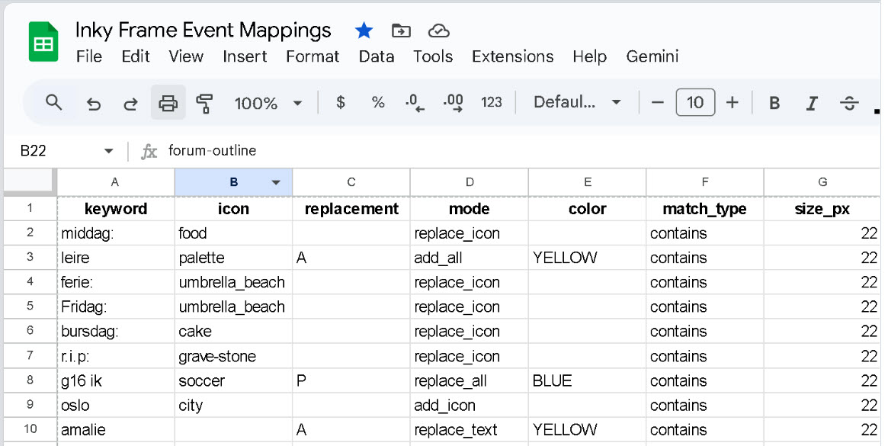

# Family E-Ink Calendar Display

This project is designed to create a family-friendly weekly calendar display on a 7.3" Inky frame e-ink screen. The calendar aggregates events from multiple sources—like your shared family Google Calendar, Norwegian public holidays, local renovation schedules, and even weather data—and displays them in a visually intuitive format.

## Data Sources

- **Google Calendar**: Pulls in all family events.
- **Norwegian Public Holidays**: Adds local holidays so everyone knows when there's a day off.
- **Weather Data**: Integrates with Norwegian weather services to show the forecast for the week.
- **Renovation Schedule (Movar)**: Displays which type of waste collection happens on which days.
- **Google Sheet Mapping**: A mapping sheet that lets you turn event titles into icons or specific tags for each family member.
  
## Hardware Setup

- **Inky Frame 7.3"**: Runs MicroPython, wakes up every 12 hours to refresh the display.
- **Raspberry Pi Server**: Does all the heavy lifting, like fetching data, rendering the calendar image, and serving it to the Inky frame. The Pi also has a small screen for local monitoring.

## How It Works

The Inky frame wakes up, makes an API call to the Raspberry Pi to get the latest calendar image, and displays it. Icons and tags are automatically replaced based on your Google Sheet mappings, making it super easy for everyone in the family to see what’s going on at a glance.

## Python Scripts Overview (main components)

- **main.py**: This is the entry point for the Inky frame. It handles waking up the device, calling the Raspberry Pi server’s API to fetch the latest calendar image, and then displaying that image on the e-ink screen. Essentially, it’s the lightweight script that runs on the Inky side and just focuses on displaying the final product.
- **data_provider.py**: This script is the workhorse on the Raspberry Pi server. It fetches and normalizes data from all the different sources: Google Calendar events, public holidays, weather forecasts, and the renovation schedule. It also handles looking up event mappings from your Google Sheet to convert event titles into icons or tags.
- **render_calendar.py**: Once the data is gathered and normalized, this script handles generating the actual calendar image. It uses a graphics library, like Pillow, to draw the weekly calendar, lay out the icons, and format everything into a final image that the Inky frame can display.
- **server.py**: This is the script that runs a lightweight web server on the Raspberry Pi. It provides an API endpoint that the Inky frame can call to request the latest calendar image, and it triggers the rendering process whenever a refresh is needed.

